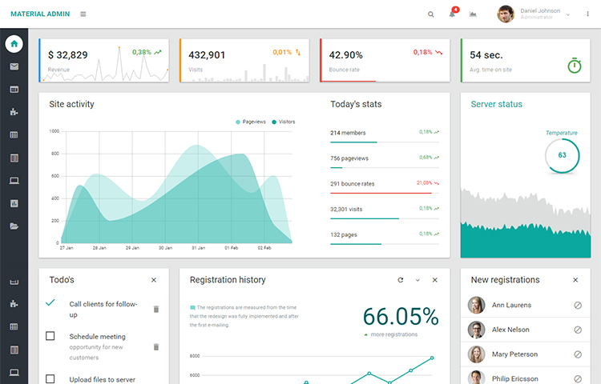

# yii2-material-admin
Assets for using Material Admin Theme in Yii2 Framework


*Backend UI for Yii2 Framework, based on [Material Admin](http://xn--80akiaokt3b4b.xn--d1acnqm.xn--j1amh/templates/demo/materialadmin/html/dashboards/dashboard.html)*
The Material Admin Template isn't free and must be purchased before using.



This package contains an [Asset Bundle for Yii 2.0 Framework](http://www.yiiframework.com/doc-2.0/guide-structure-assets.html) 
which registers the CSS files for the Material Admin user-interface.

The CSS files are installed via Yii's recommended usage of the `fxp/composer-asset-plugin` v1.1.1 or later.


Installation
------------

The preferred way to install this extension is through [composer](http://getcomposer.org/download/).

To install the Material Admin Asset run:

```
composer require abbosxon/yii2-material-admin "^1.0"
```


Quick Start
-----------

Once the extension is installed, you can have a **preview** by reconfiguring the path mappings of the view component:

For Yii 2 [Advanced Application Template](https://github.com/yiisoft/yii2-app-advanced) or [Basic Application Template](https://github.com/yiisoft/yii2-app-basic)

```php
'components' => [
    'view' => [
         'theme' => [
             'pathMap' => [
                '@app/views' => '@vendor/abbosxon/yii2-material-admin/example-views/yiisoft/yii2-app'
             ],
         ],
    ],
],
```

The Material Admin Asset uses the sourcePath **@templates/materialadmin** as default. However,if you want (or need) you can change the sourcePath reconfiguring as showed below:

```php
'components' => [
	'assetManager' => [
		'bundles' => [
			'abbosxon\materialadmin\assets\MaterialAsset' => [
    			'sourcePath' => '@app\myfolder'
			],
		],
	],
],
```

This asset bundle provides sample files for layout and view (see folder `examples/`), they are **not meant to be customized directly in the `vendor/` folder**.

Therefore it is recommended to **copy the views into your application** and adjust them to your needs.


Customization
-------------

- Copy files from `vendor/abbosxon/yii2-material-admin/example-views/yiisoft/yii2-app` (or other theme) to `@app/views`.
- Remove the custom `view` configuration from your application by deleting the path mappings, if you have made them before.

### Material Admin Plugins

Assets for Material Admin Plugins are not included in our `MaterialAdminAsset` but you can find all the files in the folder vendors inside the Material Admin Template folder .
So if you want to use any of them we recommend to create a custom bundle where you list the plugin files you need:


```php
use yii\web\AssetBundle;
class MaterialAdminAsset extends AssetBundle
{
    public $sourcePath = '@app/templates/materialadmin';
    public $js = [
        // more plugin Js here
    ];
    public $css = [
        // more plugin CSS here
    ];
    public $depends = [
        'abbosxon\materialadmin\assets\MaterialAsset',
    ];
}
```
### Left sidebar menu - Widget Menu

If you need to add more itens to the menu you can do this way:

```php
'items'=>[
	[
		'label' => 'Dashboards Slideshow',
		'icon' => 'now-widgets',
		'url' => ['/site/about'],
		'visible' => true
	],
	[
		'label' => 'Tables',
		'icon' => 'view-list',
		'url' => ['/site'],
		'items' => [
			['label' => 'Normal Tables', 'url' => ['/site/contact'],],
			['label' => 'Data Tables', 'url' => ['/site/index'],],
		],
	],
]
```

By default to icons will be added prefix of [Material Design Icons](http://xn--80akiaokt3b4b.xn--d1acnqm.xn--j1amh/templates/demo/materialadmin/html/ui/icons/materialicons.html)